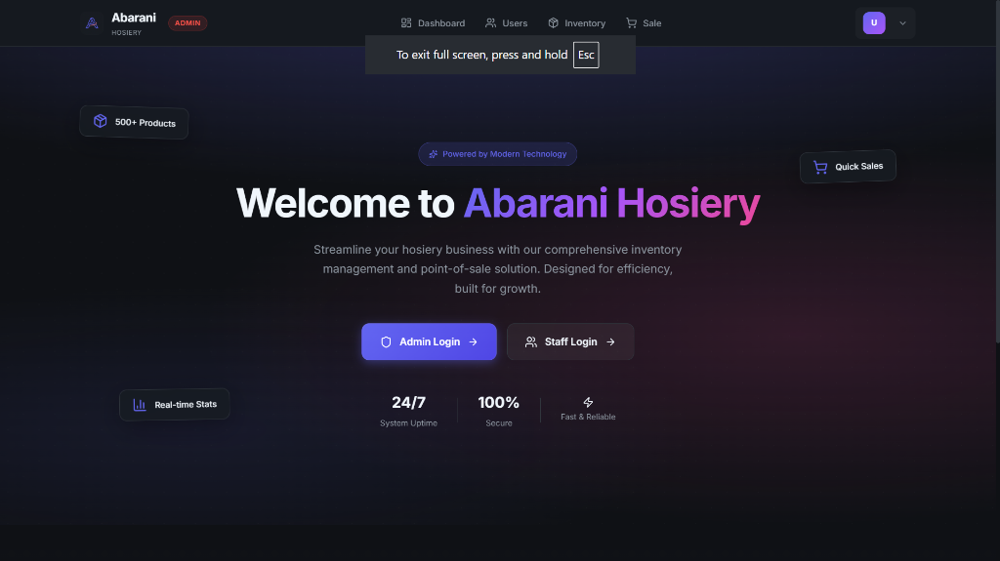

# Abarani Hosiery - Inventory & POS System



## 🚀 Live Demo
**[https://abarani-inventory-and-pos.vercel.app/](https://abarani-inventory-and-pos.vercel.app/)**

## 📖 Overview
Abarani Hosiery is a full-stack Inventory Management and Point of Sale (POS) application designed to streamline business operations. Built with the MERN stack (MongoDB, Express, React, Node.js), it offers a robust solution for tracking stock, managing users, and processing sales efficiently.

## ✨ Key Features
-   **User Management**: Admin dashboard to create, view, and delete users (Admin/Staff roles).
-   **Inventory Control**: Real-time tracking of product stock, low stock alerts, and easy product addition.
-   **Point of Sale (POS)**: Fast and intuitive billing interface with automatic stock deduction.
-   **Toast Notifications**: Beautiful, real-time alerts for actions like sales, updates, and errors.
-   **PWA Support**: Installable on mobile and desktop devices for a native app-like experience.
-   **Secure Authentication**: Role-based access control (RBAC) using JWT.

## 🛠️ Tech Stack
-   **Frontend**: React (Vite), React Router, Lucide Icons, React Toastify
-   **Backend**: Node.js, Express.js
-   **Database**: MongoDB Atlas
-   **Deployment**: Vercel (Frontend), Render (Backend)

## 📦 Installation (Local)

1.  **Clone the repository**
    ```bash
    git clone https://github.com/Deep-sarkar02/Abarani-InventoryAndPOS.git
    cd Abarani-InventoryAndPOS
    ```

2.  **Install Dependencies**
    ```bash
    # Server
    cd server
    npm install

    # Client
    cd ../client
    npm install
    ```

3.  **Environment Setup**
    Create a `.env` file in the `server` directory:
    ```env
    PORT=5000
    MONGO_URI=your_mongodb_connection_string
    JWT_SECRET=your_jwt_secret
    ```

4.  **Run the App**
    ```bash
    # Start Backend
    cd server
    node index.js

    # Start Frontend
    cd ../client
    npm run dev
    ```

## 📱 Progressive Web App (PWA)
This application is configured as a PWA. You can install it on your mobile device or desktop directly from the browser for an immersive, offline-capable experience.

---
Developed by **Kushal Ghosh** & **Deep Sarkar**
